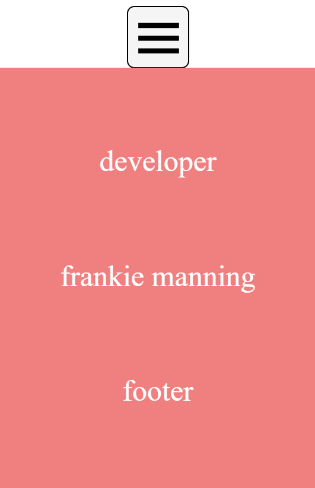

# Burger Menu :

Web component encargado de crear un menu de navegacion.

## custom properties :

Por cada **ancla** que deseemos crear deberemos accder al archivo **parametersBurgerMenu.js** que se encuentra dentro de la carpeta **utils** y crear un objeto por cada una de ellas en el cual deberemos dar valor a dos propiedades:

```
export const parametersMenu = [
    {
        href: "https://dev.to/soyleninjs/6-formas-de-convertir-un-string-en-array-con-javascript-320n",
        textContent: "developer"
    },
    {
        href: "https://www.google.com/search?q=frankie+manning&rlz=1C1JZAP_caES1008ES1008&oq=&aqs=chrome.6.35i39i362l8.4430672j0j7&sourceid=chrome&ie=UTF-8 ",
        textContent: "frankie manning"
    },
    {
        href: "#footer",
        textContent: "footer"
    }
]
```

El resultado sera :



Cada una de las anclas nos llevaran al href correspondiente.

En caso de que el **href** sea un enlace externo se añadira un **target** **_blank**.

